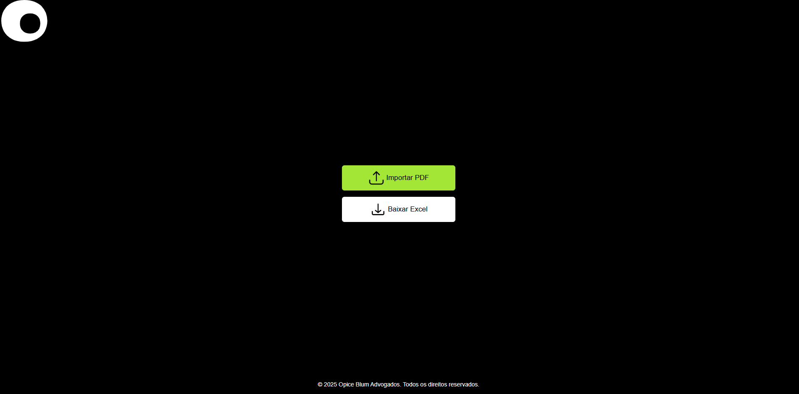

<h1 id="title">💻 Extrator de Tabelas de PDF</h1>

<p>&nbsp;O extrator de PDF é um projeto que faz a extração de tabelas de um pdf de demonstrativo de pagamentos e retorna um arquivo excel com os campos: Data, valor bruto, Retenção/Valor Pago e Historico.</p>

<p align="center">
  <a href="#title">Projeto</a>&nbsp;&nbsp;&nbsp;|&nbsp;&nbsp;&nbsp; 
  <a href="#preview">Layout</a>&nbsp;&nbsp;&nbsp;|&nbsp;&nbsp;&nbsp;
  <a href="#requirements">Pré-requisitos</a>&nbsp;&nbsp;&nbsp;|&nbsp;&nbsp;&nbsp;
  <a href="#rodando">Rodando o App</a>&nbsp;&nbsp;&nbsp;|&nbsp;&nbsp;&nbsp;
  <a href="#technologies">Tecnologias</a>&nbsp;&nbsp;&nbsp;|&nbsp;&nbsp;&nbsp; 
</p>

<h2 id="preview">🔖 Layout</h2>

<div align="center">
  
</div>

<h2 id="requirements">:hammer: Pré-requisitos</h1>

<p>&nbsp;Antes de começar, você vai precisar ter instalado em sua máquina as seguintes ferramentas: <a href="https://git-scm.com">Git</a>, <a href="https://nodejs.org/pt-br/">NodeJS</a>, um bom editor de texto para trabalhar com o código como o <a href="https://code.visualstudio.com/">VSCode</a>.</p>

<h2 id="rodando">:game_die: Rodando A aplicação</h2>

```bash
# Clone este repositório
$ git clone https://github.com/ErikPervious/BlogApp-Insider

# Acesse a pasta do projeto no terminal/cmd
$ cd EXTRACT-PDF

# Acesse api.js e coloque o link da api que faz o precesso da extração
$ const response = await fetch("http://coloque_o_link_aqui/processar_pdf",

# Feito isso, instale as dependencias do projeto
$ npm install

# Agora você pode executar a aplicação usando npm run dev
$ npm run dev

```

<h2 id="technologies">✨ Tecnologias</h2>

As seguintes ferramentas foram usadas na construção do projeto:

- [Node.js](https://nodejs.org/en/)
- [Vite(react)](https://vite.dev/)
